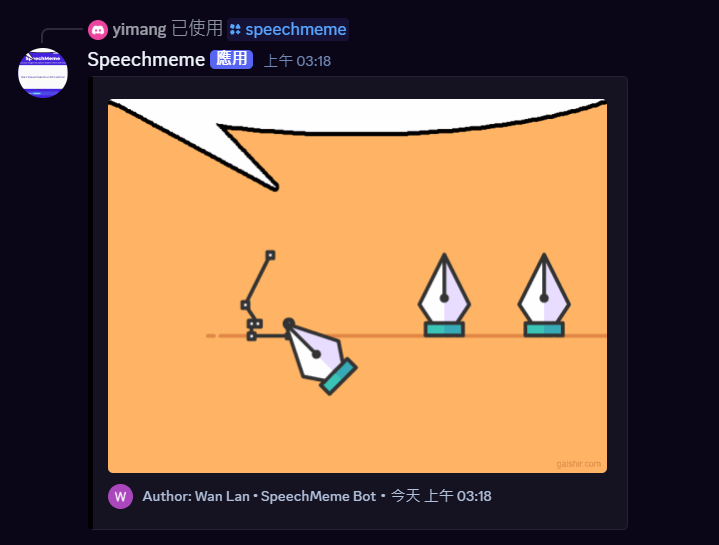

# Speechmeme Fetcher

This project is a Discord bot that fetches and displays random GIFs from speechmeme.com by reverse-engineering its API.

[Invite the bot](https://discord.com/oauth2/authorize?client_id=1421194406601691178)

## Features
- Fetches the latest speechmeme posts from the official API
- Caches results locally to reduce API calls
- Provides a Discord slash command to display random speechmeme GIFs
- Supports user install and multiple contexts (guild, DM, private channel)

## Technical Details
- Fetches up to 100 latest speechmeme GIFs from speechmeme.com when the local cache is older than 2 hours
- Uses a caching mechanism to minimize unnecessary API requests
- Integrates with Discord using discord.py and slash commands
- Stores cached data locally for fast retrieval
- Handles cache expiration and refresh automatically

## Setup
1. Clone this repository
2. Install dependencies: `pip install -r requirements.txt`
3. Create a `.env` file and add your Discord bot token
4. Run the bot: `python bot.py`